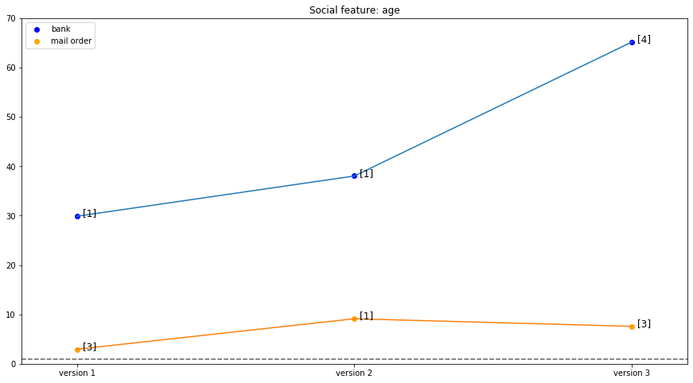
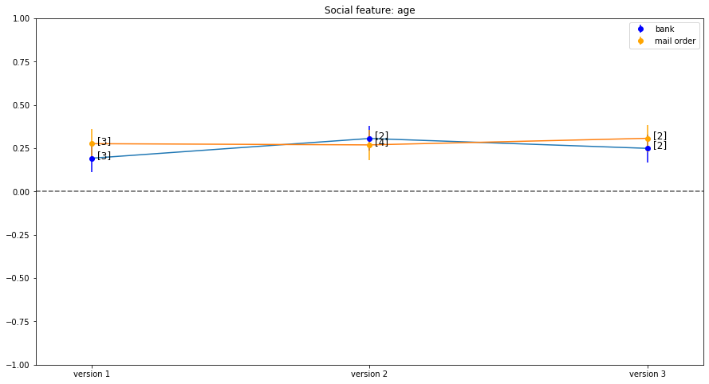
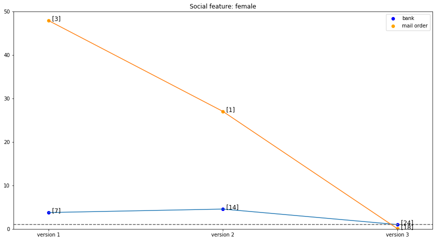
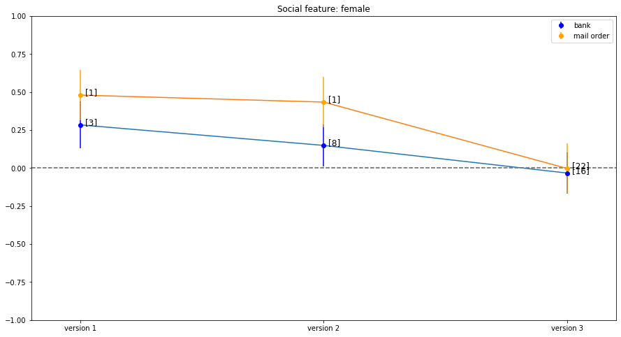
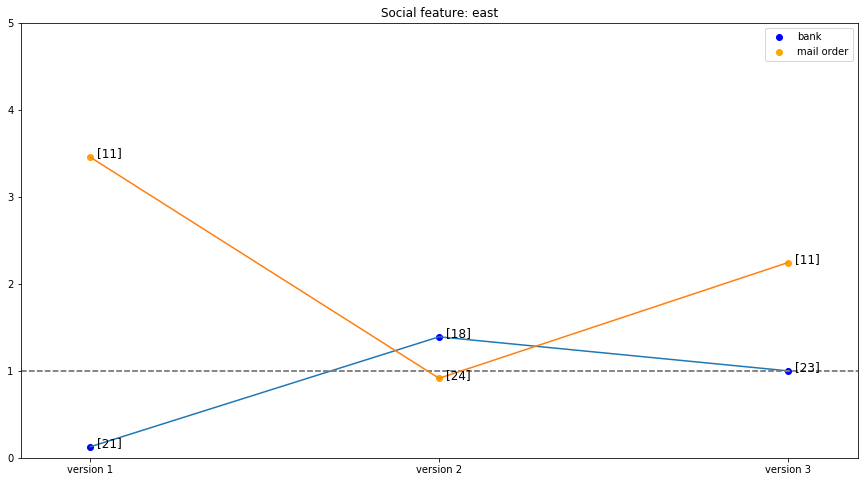
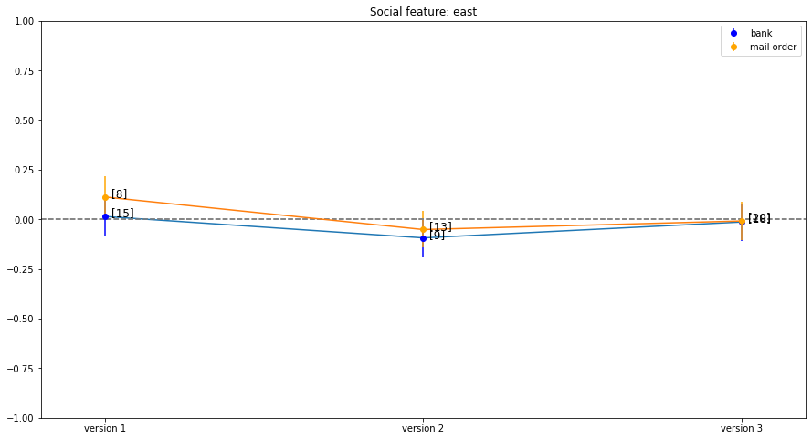

# Case study about the influence of social dimensions on solvency scores

## About the project
The result of this project is the master thesis 

### The data set and the openSCHUFA project

The unstructured form of the SCHUFA-reports and the structured questionnaire data was provided by the openSCHUFA project which consisted of the AlgorithmWatch Initiative and the Open Knowledge Foundation in 2018.
A very time-consuming process to again convert the data into structured data had been done by the editors of the data teams of SPIEGEL Online and Bayerischer Rundfunk (BR). This extracted form of structured data, combined with the data of the questionnaire, was then provided by the data journalists of SPIEGEL Online for this thesis.

### The Goal of the study

The goal of the study is to analyse the influence of selected social dimensions on the different versions of selected sector scores of the SCHUFA solvency score. This is meant to start a discussion on how algorithmic systems potentially take part in reproducing a disparate distribution of resources by explicitly using or implicitly reflecting social dimensions in the output they produce. What parts of it do we as a society accept and what needs to be taken into account by the constructors and users of such algorithms.

## Results

Generally, the observed results of the analysis of age and sex can be partly viewed as
evidence for discrimination bias regarding the examined scores in the data set.

### Age

 
Relevance score of the gaussian process of age feature per version of the bank and mail order sector score
 

 
Standardized coefficient of the linear regression of age feature per version of the bank and mail order sector score
  

While the linear regression model weight shows a drop between version 2 and version 3, the relevance score of the Gaussian process model though, is higher for this version then for version 2. This incosistency shows the that we cannot be certain about the magnitude of weights between versions but we can state with high certainty that the bank score has a discrimination bias along age in the openSCHUFA data set. The figure shows also the difference in score versions of the mail order score in comparison to the bank sector score. We can see that the relevancy of age is in both sector scores on a similar magnitude.

The analysis of the age variable showed strong evidence in the data set for a discrimination bias according to the model comparison and weight examination. The older a person gets, the better his or her score will be. As we have seen in the descriptive analysis of the data set, the age variable is associated with many other variables such as the employment or family status of a person, as well as the monthly income.

### Being female

 
Relevance score of the gaussian process of female feature per version of the bank and mail order sector score
 

 
Standardized coefficient of the linear regression of female feature per version of the bank and mail order sector score
  

In the figure we can see that the relevance of being female drops as the version becomes more recent in the openSCHUFA data set. This illustrates our conclusion that there is a small uncertain discrimination bias in the bank score in version 1 which gets even more uncertain with the version 2 and practically vanishes in version 3. Hence the version of the bank sector score is relevant for the strenght of the effect of the discrimination bias of the sex.

The figure also shows the relevance of the feature of being female in the mail order sector score. We can see that there is much stronger and therefore certain effect compared to the bank sector score. It is also a more consistent effect comparing the models Gaussian process and linear regression model. Interesstingly, the effect seems to get even higher in version 2 and then drops to an ignorable effect in version 3. Hence, the discrimination bias of the sex increases in the version 2 of the mail order sector score and significantly decreases in version 3.

There is a small discrimination bias along the female feature in the openSCHUFA data set. Its strength differs between the version and sector of the score. In the bank score the bias decreases with the version examined and there seems no evidence for the bias in version 3. The mail order score differs with a higher magnitude of weight and because the version 2 seems to have even stronger evidence for discrimination bias than version 1. Though the bias again vanishes with version 3 of the mail order score.

The analysis of the influence of the social dimension sex yielded much weaker evidence for a discrimination bias in the data set. The result indicated a better score for a person to be female than being male. This observed discrimination bias was stronger in the first version and depending on the sector increased or reduced in the version 2 of the examined scores and eventually almost vanished in the version 3 of the scores. The mail order score in the data set evidently had a higher discrimination bias along the dimension sex than the bank score.

### Being located in historic east of germany

 
Relevance score of the gaussian process of east feature per version of the bank and mail order sector score
 

 
Standardized coefficient of the linear regression of east feature per version of the bank and mail order sector score
  

The east feature shows no significant result, that would indicate a discrimination bias along being located in western or eastern states of Germany. Hence, there is no strong evidence for a worse or better score when living in eastern states.

The variable indicating a persons lives in eastern or western states of Germany did not lead to strong evidence for a discrimination bias along this location-dependent information in the openSCHUFA data set. Hence, we are very uncertain about its influence on the score.

A more extensive discussion of the results can be found in the master thesis.

## Technical information

The analysis was conducted using jupyter notebooks and the scripting language python. For visualizations the python libraries pyplot and seaborn were used. For the descriptive analysis scipy and pandas were used. In the multivariate analysis sklearn were used for separating training data, statmodels were used for the parametric analysis with linear regression and tensorflow as well as gpflow were used for the non-parametric analysis with gaussian processes.

## Approach

1. Clean the data set
	1. Check for duplicates
	2. Filter invalid data
	3. Remove outliers
	4. Remove score values that are invalid

2. Create features from questionaire and SCHUFA-Auskunft

3. Univariate descriptive analysis
	1. Analyse frequency distributions of all features
	2. Analyse representation biases in the data by comparing social feature relative frequencies with German population
	3. Analyse frequency distributions of solvency scores and the respective versions to select two sector scores: Banking and Mail Order

4. Bivariate descriptive analysis
	1. Analyse associations between social and financial features
	2. Analyse associations between social features and selected solvency scores

5. Feature preprocessing
	1. Score Transformation for versions 2 and 3 using the log Function
	2. Conversion of categorical, ordinal and metric features
	3. Standardization of metric data

6. Subsampling w.r.t. chosen social dimensions (age, sex, historical east/west germany)
	1. Analyse correlations to check which covariates may mediate an effect
	2. Apply matching algorithm to obtain similar distributions of covariates. This enables us to compare only attributes that are present in all groups w.r.t. a social dimension

7. Multivariate analysis
	1. Feature engineering to account for interactions and feature selection to only use relevant features
	2. Parametric approach: Multivariate linear regression to analyse the influence of selected social dimensions according to the respective coefficients as well as the variance explained
	3. Non-parametric approach: Gaussian process to analyse the variance explained by a social dimension
	4. Visualize the influences: Show the influence of social dimensions over the different versions of the selected sector scores

## Contact

- You can contact me via E-Mail: waackphilipp [at] gmail.com
- The [repository](https://github.com/waackph/solvency_scoring_social_bias_analysis)
- My [GitHub profile page](https://waackph.github.io/)
